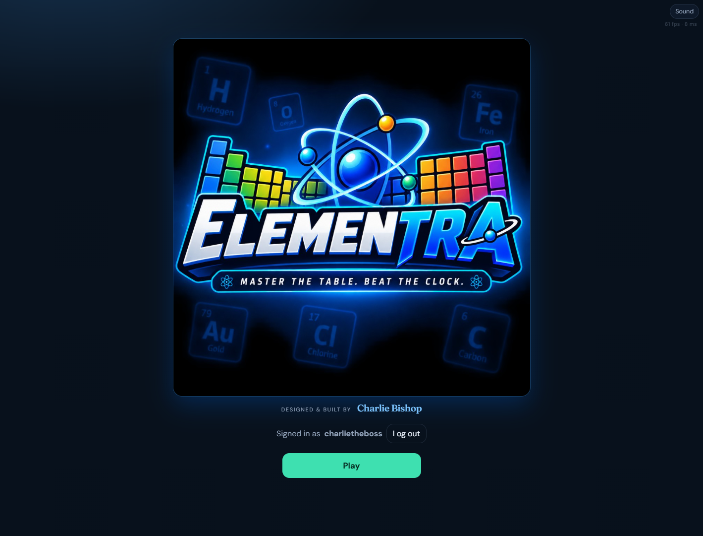
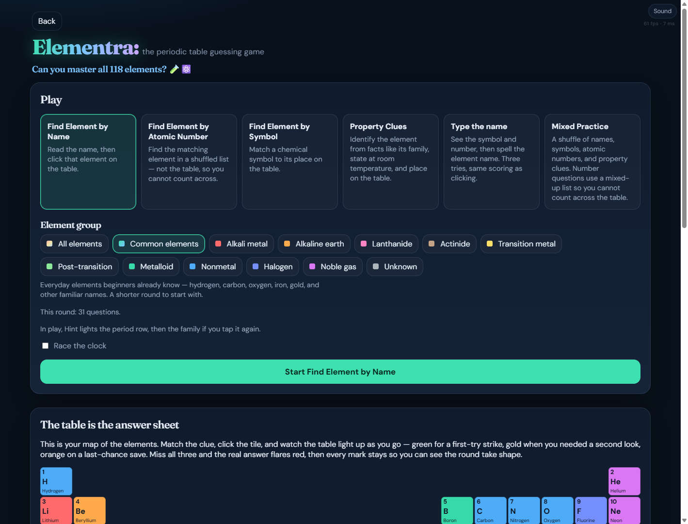

# Elementra: the periodic table guessing game

Elementra is a fast-paced periodic table challenge inspired by geography games like Seterra. Find elements by name, symbol, atomic number, property clues, or by typing the name from the symbol. Race the clock, build accuracy, and work your way up to all 118 elements.

Play it at [charlietheboss.com](https://charlietheboss.com) on a computer or a phone.



## Play

- **Modes** — find by name, symbol, or atomic number; Property Clues; Type the name; or Mixed Practice.
- **Groups** — Common elements for a short beginner round, a chemical family, or the whole table.
- **Scoring** — three guesses each. A first try is 1 point; later tries score less. A round is every element in the group you picked.
- **Hint** — on large groups, lights the period row; on All or Common, a second tap lights the family.
- **Progress** — scoreboard and element ranks stay in this browser. Ranks show the top 3 until you tap Show more. Register or log in is optional (a popup you can close). Usernames are unique; scores still stay on the device that registered.
- **Sound** — the top-right menu mutes voices, effects, or both. Name questions are spoken so you hear the name.

Atomic-number questions use a shuffled list so you cannot count across the table. Mixed Practice can ask those too, plus names, symbols, and property clues.



## How to run it

Prerequisites:

- [Node.js](https://nodejs.org/) 20 or newer (the project is developed on the current LTS)

Install and start a local dev server:

```bash
npm install
npm run dev
```

Open **http://127.0.0.1:5173** (http, not https). The dev server is pinned to that address and port so it does not jump to 5174 or listen only on IPv6. There are no env files or secrets.

## How it is built

Vite + React + TypeScript. Element facts live in one table (`src/data/elements.ts`). Game modes are registered in `src/game/modes.ts` so new modes can reuse the same data and scoring.

```bash
npm run dev      # http://127.0.0.1:5173 (fails if that port is already taken)
npm run test     # game-logic unit tests
npm run build    # typecheck and write production files to dist/
npm run preview  # serve the dist/ build locally
npm run lint     # oxlint
```

`npm run build` writes production files to `dist/` with site-root URLs (`base: '/'`) for [charlietheboss.com](https://charlietheboss.com). The title art is bundled into `/assets` (not a raw `/logo.jpg`). Upload the contents of `dist/`, not the project source. Preserve `public_html/.well-known/` if you rsync onto the live docroot. Username claims use `api/usernames.php` when the host runs PHP; names are stored in `elementra-usernames.json` next to `public_html`. If PHP is not enabled, two people on different devices can still pick the same name (this browser still blocks a duplicate).

This project is licensed under the [GNU General Public License v3.0](LICENSE).
